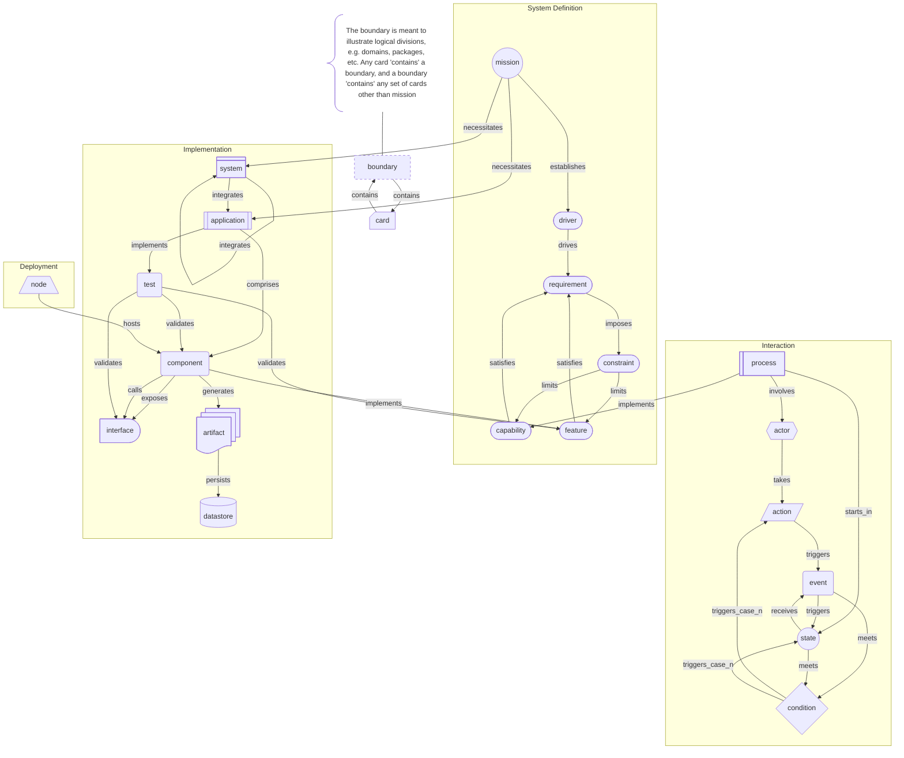

# AURORA Machine Agent Instruction

## Model Overview

**Version**: 1.1.0
**Ontology**: Element-centric, link-relationship model

AURORA is a deterministic, JSON-based architectural model where architectural elements are Cards, Links represent the relationships between Cards, and the model forms a Directed Graph away from the `mission`. The model is designed for direct machine consumption by LLMs, agents, reasoners, and automated tools, as well as human readability.

**One Goal**: Enable the Architect to focus on modeling the architecture instead of diagrams and pictures.

### Principles

- Eliminate ambiguity by enforcing strict structural rules.
- Produce and persist the model in open, machine readable formats.
- Enable agentic creation and editing of the model.

## Card Structures

### Files

A `Model` is comprised of a collection of cards, starting from the `mission` card. Cards are stored in JSON files, one file per Card.

Files must be named in the form `{id}-{uuid}.json`, in lowercase. If a `card_subtype` exists, name it as `{card_subtype}-{id}-{uuid}.json`.

Files must be stored in a folder named `AURORA`, in subfolders named for the `card_type` in title case, e.g., `AURORA/Requirement`. The only exception is the `mission` card, which should always be stored at `AURORA/mission-{uuid}.json` to provide a consistent entry point.

An entire `Model` may be stored in a ZIP-compressed file to allow for portability as long as the folder structure is preserved.

**Example**:

```text
|- AURORA
        |- mission-8f3c9d27-6b4e-4a91-b2e7-5d1f0c6a9e42.json
     |- Driver
     |    |- find_the_signal-2c7e1a4b-9f3d-4c6a-8e52-0f7b1d9a3c84.json
     |- Requirement
     |    |- analyze_breach_data_dumps-b6f0e2d9-1a4c-4f8b-9c37-52a1e8d4f6b0.json
```

### JSON Format

The exact format can be found in the [AURORA.schema.json](AURORA.schema.json) JSON schema.

**Example**:

```json
{
  "audit_history": [
    {
      "user": "user",
      "event": "created",
	  "timestamp": "2025-01-01T00:00:00Z"
    }
  ],
  "attributes": {
    "key": "value",
    "key2": {
                        "property": "value"
    }
  },
        "card_type": "boundary",
  "card_subtype": "domain",
  "description": "Plain text explanation of scope and intent",
        "id": "dumptruck_mission",
  "links": [
    {
      "relationship": "drives",
      "target": "0f4b6e2e-6e60-47b3-9fda-49c4c3a2a9b8"
    }
  ],
  "name": "Human-Readable Title",
  "status": "proposed",
  "uuid": "7c0d2c45-6df4-4b8a-9f3a-2a8f7aa6f0d1",
  "version": "1.0.0"
}
```

**Required fields**: `uuid`, `id`, `card_type`, `name`, `description`, `version`, `audit_history`

#### Field Descriptions

- `uuid` - UUID v4 or v7 that never changes for the life of the card
- `id` - A short name for the card in `snake_case`
- `card_type` - The architectural type represented by the card.
Default types (per the diagram below): `mission`, `driver`, `requirement`, `capability`, `feature`, `constraint`, `actor`, `action`, `condition`, `event`, `process`, `state`, `system`, `application`, `component`, `interface`, `test`, `artifact`, `datastore`, `node`, `boundary`.
- `card_subtype` - An optional refinement of the `card_type`, for example a `boundary` card may have the `card_subtype` `domain`, `vlan`, etc.
- `name` - A concise human readable name for the card
- `description` - Details regarding the element the card represents
- `version` - semver version of the particular card, updated whenever the card changes
        *The revision is incremented for minor edits, such as spelling, grammar, edits to a few words
        * The minor version is incremented for more significant changes, such as the entire `description` changing, adding or removing links, etc.
        * The major version is incremented for changes that alter the card's role in the architecture, including renaming, re-id-ing, changing `card_type`, or changing `card_subtype`
- `status` - the status of an implementable element; one of: proposed, pending, implementation, review, verified, deprecated, retired. Changes to this field do not trigger `version` changes.
- `attributes` - Key-value pairs providing additional data; the value can be any valid JSON value, including objects. This field is primarily meant for use by tooling and agents.

- `links` - relationships between cards, always directed away from `mission`. Examples can be found at the end of the document.
    * `target` - the `uuid` of the destination card
    * `relationship` - a single-word description of the relationship (view-dependent)
                - e.g. `drives`, `implements`, `hosts`
- `audit_history` - A record of the events - created, edited, etc. - the card has been through
        - `event` - The type of change made to the card: created, edited, deleted
        - `user` - The user ID who made the change
        - `timestamp` - ISO 8601 UTC timestamp of the change

## Logical Structure

The logical structure of AURORA is designed to be easily extended to meet the needs of any architecture. While the structure and rules here are inviolate, they do not limit what is represented in the model and impose only necessary limitations on links.

### Cards

- The list of card types and subtypes included here is by far not exhaustive. Because the type and subtype directly encode their semantic meaning, any type that makes sense in your model may be used.
- The cards themselves and the links between them do not encode any semantic meaning. They only represent the elements of the architecture and their connections.

### Link Rules

1. **Direction**: All links point away from the `mission` card, forming a directed graph. Multiple paths may converge and local loops may exist, but there must not be a path all the way back to the `mission` card.
2. **Semantics**: Links have a `relationship` that describes them but does not convey semantic meaning. Semantic meaning is provided by generating Views of the model. The `relationship` is entirely for the convenience of humans.
3. **`mission` card**: The first card, and root of the graph, is the `mission` card which represents the project mission. The `mission` card only has outgoing links and must not be the target of a link.
4. **Every other card**: Must be the target of at least one incoming link from `mission` (directly or indirectly). May have any number of incoming or outgoing links.
5. **Hierarchy**: Cards form a directed graph from `mission`. Local cycles are allowed for bounded subgraphs such as state machines (for example: `state → condition → state`) and event/action-driven transitions, as long as links do not create a path out of the local area and back to `mission`.
6. **Validation**: All `links[].target` values must reference existing cards by `uuid`.
7. **`boundary` cards**: `boundary` cards are special, in that they denote the separations, such as domains, in the model. `boundary` cards, in addition to an incoming link, must have one or more outgoing links showing what the boundary contains. They still must orient away from `mission`, and cannot link to `mission` itself.

## Processing Instructions for Agents

### Loading

1. Read all JSON card files (for this repo: `docs/design/AURORA/cards/*.json`).
2. Build adjacency lists: `card_uuid` pointing to `target_card_uuids`.
3. Index by `uuid` (canonical) for O(1) lookups.
4. Verify schemas using [AURORA Schema](AURORA.schema.json) if available.

- **Traceability**: Walk downstream from any `mission` to any card to establish provenance.
- **Coverage**: Count cards by type and status to assess completeness. E.g., `How many requirements have tests?` → count `requirement` cards that link to `test` cards.
- **Impact Analysis**: Change in card X → find all cards up and downstream of X (follow incoming and outgoing links) to identify affected cards.

## Views

### Common Views

To derive any view:

1. Select one or more starting cards, e.g., the `mission` for a Requirements View.
2. Walk outgoing links to produce a candidate subgraph.
3. Filter cards by `card_type` and/or attributes relevant to the view.

Common views and how to derive them:

- **Requirements Traceability**: Cards: `mission`, `driver`, `capability`, `feature`, `requirement`, `constraint`, `test`. Derivation: traverse from `mission`; keep the listed types; optionally collapse intermediate nodes to show `mission` → `requirement` → `test` coverage.

- **Capability Map**: Cards: `driver`, `capability`, `feature`, `process`. Notes: `capability` is typically a multi-modal workflow, most often expressed via one or more `process` cards. Derivation: keep only `capability`/`feature` cards reachable from each `driver`; group by the first `driver` ancestor.

- **Component Architecture**: Cards: `system`, `application`, `boundary`, `component`, `interface`, `artifact`, `datastore`, `node`, `test`. Derivation: keep structural runtime elements and their direct links; use `boundary` cards to denote trust or deployment boundaries.

- **Interface / API Surface**: Cards: `interface`, `actor`, `component`, `action`. Derivation: keep actors and the interfaces they touch; interpret `calls` links as connectivity between `component` and `interface`.

- **Data Flow and Storage**: Cards: `datastore`, `component`, `interface`, `artifact`. Derivation: keep nodes that produce/consume stored artifacts; interpret `links` as “flows_to” in this view.

- **Threat Model and Controls**: Cards: `constraint`, `boundary`, `component`, `datastore`, `interface`, `test`. Derivation: traverse from `mission` to include security-related `constraint` cards and the runtime elements they apply to; use `attributes` for threat/control metadata.

- **Deployment Topology**: Cards: `node`, `boundary`, `application`, `component`, `datastore`. Derivation: keep deployable elements; interpret `node` as a hosting target and `boundary` as network/zone segmentation.

- **Action / Process Flow**: Cards: `actor`, `action`, `condition`, `event`, `state`, `process`, `interface`. Derivation: keep actions and their prerequisites/conditions; interpret `links` as “enables_next_step” in this view.

Views **do not change the model**; they change what part of and how the model is viewed. One model, many views.

## Constraints and Guardrails

1. **No semantic type in links**: Agents must not invent link types. Use view overlays instead.
2. **All links away from `mission`**: Agents must not create links that point towards `mission`. Local cycles are permitted only when modeling bounded flows such as state machines.
3. **No orphans**: Every card except `mission` must be reachable via a path starting from `mission`.
4. **Audit everything**: Every change must create an audit entry.

## Exemplars

This section describes, in plain English, how to represent common architecture “diagram types” as AURORA cards and links. This list is not exhaustive, and a view can be composed by selecting any set of card types and displaying those cards and their links.

### Requirements View

- Start from the `mission` card.
- Ensure all requirement-related cards are reachable from `mission` via `mission` → `driver` → `requirement`.
- Create `driver` cards for major forces (security, performance, operability, etc.).
- Create `capability` and/or `feature` cards to describe what the system must enable.
- Create `requirement` cards for concrete, testable statements.
- Use `constraint` cards for non-functional requirements.
- Link `mission` → `driver` (relationship: `establishes`).
- Link `driver` → `requirement` (relationship: `drives`).
- Link `capability` → `requirement` (relationship: `satisfies`).
- Link `feature` → `requirement` (relationship: `satisfies`).
- Link `requirement` → `constraint` (relationship: `imposes`).
- Link `constraint` → `capability`/`feature` (relationship: `limits`) where applicable.
- Link `component` → `feature` (relationship: `implements`).
- Link `test` → `feature`/`component`/`interface` (relationship: `validates`) to express test coverage.

### Use Case View

- Start from the `mission` card.
- Create or reuse a `capability` card to represent the user goal.
- Create a `process` card to represent the workflow.
- Link `process` → `capability` (relationship: `implements`).
- Create `actor` cards for external users/systems.
- Link `process` → `actor` (relationship: `involves`).
- Model the interaction mechanics using `condition`, `action`, `event`, and `state` cards:
   	* Link `actor` → `action` (relationship: `takes`).
   	* Link `condition` → `action` (relationship: `triggers_case_n`).
   	* Link `action` → `event` (relationship: `triggers`).
   	* Link `state` → `event` (relationship: `receives`).
   	* Link `event` → `state` (relationship: `triggers`).
   	* Link `state`/`event` → `condition` (relationship: `meets`).

### Component View

- Start from the `mission` card.
- Create a `system` and/or `application` card for the overall product.
- Link `mission` → `system`/`application` (relationship: `necessitates`).
- If modeling integration, link `system` → `system`/`application` (relationship: `integrates`).
- Create `boundary` cards for trust zones (local machine, public internet, internal network).
- Create `component` cards for runtime units and code units.
- Use `boundary` cards to denote trust/deployment zones.
   	* Link card → `boundary` (relationship: `contains`).
   	* Link `boundary` → card (relationship: `contains`).
- Link `application` → `component` (relationship: `comprises`).
- Create `interface` cards for major public entrypoints (CLI, HTTP API, job queue, etc.).
- Create `datastore` cards for durable storage.
- Create `artifact` cards to represent persisted data elements.
- Link `component` → `interface` (relationship: `exposes`) as appropriate.
- Link `component` → `interface` (relationship: `calls`) when modeling `calls` paths.
- Link `component` → `artifact` (relationship: `generates`) → `datastore` (relationship: `persists`) to express durable storage.
- If modeling delivery of features, link `component` → `feature` (relationship: `implements`).

### Deployment Diagram

- Start from the `mission` card.
- Create `boundary` cards for network segments or trust boundaries.
- Link `mission` → `boundary` (relationship: `contains`) so hosting topology is reachable from `mission`.
- Create `node` cards for runtime hosts (laptop, server, container node).
- Create `application` and/or `component` cards for deployable units.
- Link `boundary` → `node` (relationship: `contains`).
- Link `node` → `component` (relationship: `hosts`).
- Optionally link `boundary` → `application` (relationship: `contains`) to make the overall product topology explicit.
- Create `artifact` cards to represent data elements.
- Link `component` → `artifact` (relationship: `generates`).
- Create `datastore` cards for durable storage.
- Link `artifact` → `datastore` (relationship: `persists`) to show persistence dependencies.

### Process / Sequence / Activity Views

- Start from the `mission` card.
- Ensure the process subgraph is reachable by anchoring it under an existing `capability` card (reachable from `mission` via runtime elements implementing the capability).
- Create a `process` card.
- Link `process` → `capability` (relationship: `implements`).
- Create `actor` cards for participants.
- Link `process` → `actor` (relationship: `involves`).
- Model the workflow lifecycle as a state machine.
   	* Link `process` → `state` (relationship: `starts_in`) to indicate the initial state.
   	* Link `state` → `condition` (relationship: `meets`) → `state` (relationship: `triggers`) for transitions.
- Model the interaction mechanics using `condition`, `action`, `event`, and `state` cards:
   	* Link `actor` → `action` (relationship: `takes`).
   	* Link `condition` → `action` (relationship: `triggers_case_n`).
   	* Link `action` → `event` (relationship: `triggers`).
   	* Link `state` → `event` (relationship: `receives`).
   	* Link `event` → `state` (relationship: `triggers`).
   	* Link `state`/`event` → `condition` (relationship: `meets`).
- Model endpoints as `interface` cards and connectivity via runtime elements.
   	* Link `component` → `interface` (relationship: `exposes`).
   	* Link `component` → `interface` (relationship: `calls`).

### State Diagram

- Start from the `mission` card.
- Anchor the state graph under a reachable runtime element (common: `mission` → `boundary` → `application` → `component`).
   	* Link card → `boundary` (relationship: `contains`) → card (relationship: `contains`).
   	* Link `application` → `component` (relationship: `comprises`).
- Model `state` cards.
- Model transitions using `condition` cards (guards/branches). A `condition` may have multiple outgoing transitions (for example: `triggers_yes` and `triggers_no`).
- State machines either loop back to the initial state or have a terminal state.
- External triggers (outside effector):
   	* Link `actor` → `action` (relationship: `takes`) → `event` (relationship: `triggers`) → `state` (relationship: `triggers`).
- State transitions (from one state to another):
   	* Link `state` → `condition` (relationship: `meets`) → `state` (relationship: `triggers`).
- Link `component` → `process` (relationship: `implements`) → `state` (relationship: `starts_in`) to anchor the state graph under the component.

### Communication Diagram

- Start from the `mission` card.
- Model participants as `actor` and/or `component` cards.
- Prefer diagram-consistent relationships for connectivity:
   	* Link `component` → `interface` (relationship: `calls`).
   	* Put message details in `attributes` on the calling `component` and/or the `interface`.

## Default Card Types and Recommended Links

The following diagram illustrates the composition of a typical AURORA model, including card types and common links. This composition can be rendered into any common architectural view, and maps to diagramming based systems such as UML and SysML.


