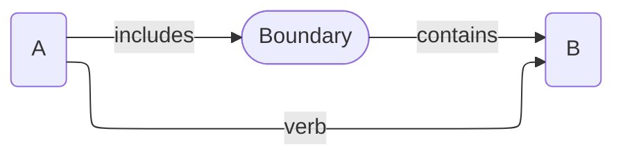
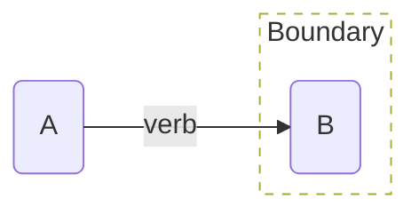
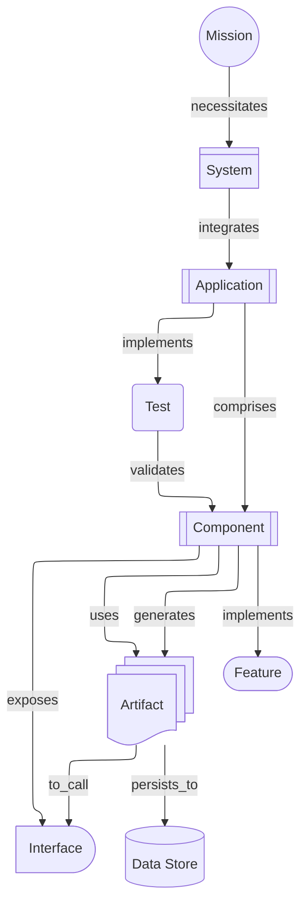
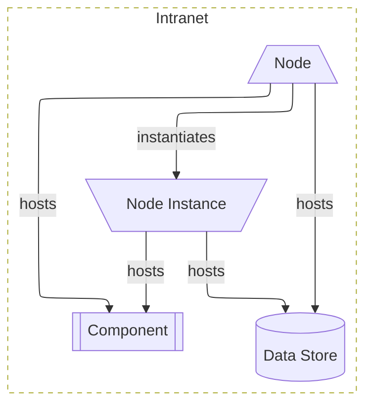
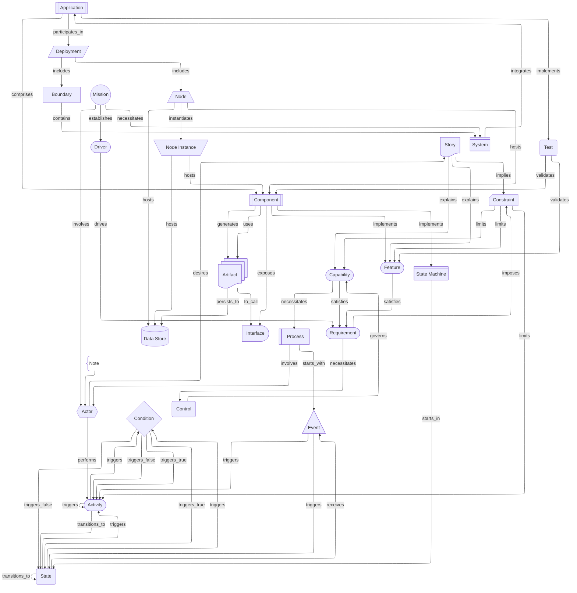
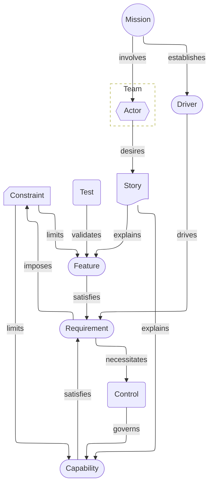
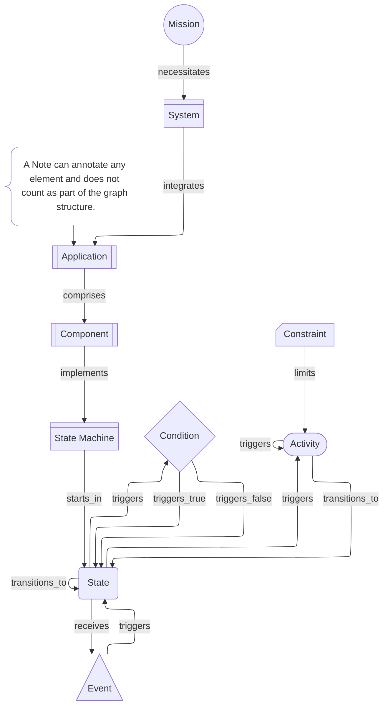
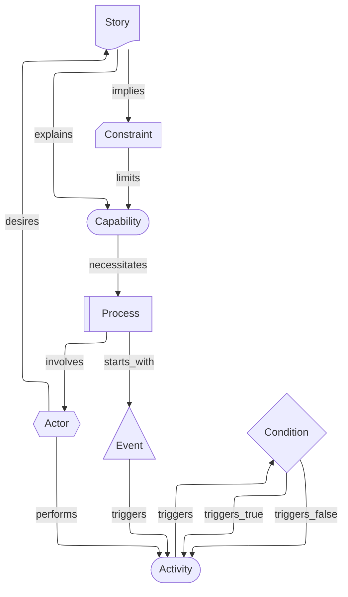

# Aurora Machine Agent Instruction

## Model Overview

**Version**: 2.0.0
**Ontology**: Element-centric, link-relationship model

Aurora is a deterministic, JSON-based architectural model where architectural elements are Cards, Links represent the relationships between Cards, and the model forms a Directed Graph away from the `mission`. The model is designed for direct machine consumption by LLMs, agents, reasoners, and automated tools, as well as human readability.

The directed graph invariants apply to all cards and links **except** `note` cards. `note` cards are annotations and are explicitly excluded from the graph (details below).

**One Goal**: Enable the Architect to focus on modeling the architecture instead of diagrams and pictures.

### Principles

- Eliminate ambiguity by enforcing strict structural rules.
- Produce and persist the model in open, machine readable formats.
- Enable agentic creation and editing of the model.

## Card Structures

### Files

A `Model` is comprised of a collection of cards, starting from the `mission` card. Cards are stored in JSON files, one file per Card.

Files must be named in the form `{id}-{uuid}.json`, in lowercase. If a `card_subtype` exists, name it as `{card_subtype}-{id}-{uuid}.json`.

Files must be stored in a folder named `aurora`, in subfolders named for the `card_type` in title case, e.g., `aurora/Requirement`. The only exception is the `mission` card, which should always be stored at `aurora/mission-{uuid}.json` to provide a consistent entry point.

An entire model may be stored in a ZIP-compressed file to allow for portability as long as the folder structure is preserved.

**Example**:

```text
|- Aurora
        |- mission-8f3c9d27-6b4e-4a91-b2e7-5d1f0c6a9e42.json
     |- Driver
     |    |- find_the_signal-2c7e1a4b-9f3d-4c6a-8e52-0f7b1d9a3c84.json
     |- Requirement
     |    |- analyze_breach_data_dumps-b6f0e2d9-1a4c-4f8b-9c37-52a1e8d4f6b0.json
```

### JSON Format

The exact format can be found in the canonical JSON schema at `schemas/Aurora.schema.json`.

**Example**:

```json
{
	"audit_history": [
		{
			"user": "user",
			"event": "created",
			"timestamp": "2025-01-01T00:00:00Z"
		}
	],
	"attributes": {
		"key": "value",
		"key2": {
			"property": "value"
		}
	},
	"card_type": "boundary",
	"card_subtype": "domain",
	"description": "Plain text explanation of scope and intent",
	"id": "dumptruck_mission",
	"links": [
		{
			"relationship": "drives",
			"target": "0f4b6e2e-6e60-47b3-9fda-49c4c3a2a9b8"
		}
	],
	"name": "Human-Readable Title",
	"status": "proposed",
	"uuid": "7c0d2c45-6df4-4b8a-9f3a-2a8f7aa6f0d1",
	"version": "1.0.0"
}
```

**Required fields**: `uuid`, `id`, `card_type`, `name`, `description`, `version`, `audit_history`

#### Field Descriptions

- `uuid` - UUID v4 or v7 that never changes for the life of the card
- `id` - A short name for the card in `snake_case`
- `card_type` - The architectural type represented by the card.
    + **Naming**: `card_type` values must be `snake_case`, consistent with `id`.
    + Common types (as used in the Everything View): `mission`, `driver`, `requirement`, `capability`, `feature`, `constraint`, `actor`, `action`, `condition`, `event`, `process`, `state`, `state_machine`, `system`, `application`, `component`, `interface`, `test`, `artifact`, `data_store`, `node`, `node_instance`, `deployment`, `boundary`, `control`, `activity`, `story`, `note`.
- `card_subtype` - An optional refinement of the `card_type`, for example a `boundary` card may have the `card_subtype` `domain`, `vlan`, etc.
- `name` - A concise human readable name for the card
- `description` - Details regarding the element the card represents
- `version` - semver version of the particular card, updated whenever the card changes
    _The revision is incremented for minor edits, such as spelling, grammar, edits to a few words
    _ The minor version is incremented for more significant changes, such as the entire `description` changing, adding or removing links, etc. \* The major version is incremented for changes that alter the card's role in the architecture, including renaming, re-id-ing, changing `card_type`, or changing `card_subtype`
- `status` - the status of an implementable element; one of: proposed, pending, implementation, review, verified, deprecated, retired. Changes to this field do not trigger `version` changes.
- `attributes` - Key-value pairs providing additional data; the value can be any valid JSON value, including objects. This field is primarily meant for use by tooling and agents.

- `links` - relationships between cards, always directed away from `mission`. Examples can be found at the end of the document.
    + `target` - the `uuid` of the destination card
    + `relationship` - a single-token description of the relationship (view-dependent) - e.g. `drives`, `implements`, `hosts`, `triggers_false`
- `audit_history` - A record of the events - created, edited, etc. - the card has been through - `event` - The type of change made to the card: created, edited, deleted - `user` - The user ID who made the change - `timestamp` - ISO 8601 UTC timestamp of the change

## Logical Structure

The logical structure of Aurora is designed to be easily extended to meet the needs of any architecture. While the structure and rules here are inviolate, they do not limit what is represented in the model and impose only necessary limitations on links.

### Cards

- The list of card types and subtypes included here is by far not exhaustive. Because the type and subtype directly encode their semantic meaning, any type that makes sense in your model may be used.

- The cards themselves and the links between them do not encode any semantic meaning. They only represent the elements of the architecture and their connections.

#### Special Cards

##### The `mission` Card

The root card of the model is _always_ a `mission` card. The `mission` card captures the overarching purpose and goal of the model. A given model must only have a single `mission` card.

##### `boundary` Card

The `boundary` card represents a logical grouping of other cards, in other workd they contain them. `boundary` cards frequently "contain" `system`, `application`, `node`, `process`, `state_machine`, and similar higher level cards, and often their descendants. They are linked from a parent of and to the contained card, e.g., parent --> boundary --> contained, always in parallel to another link.

A `boundary` card may include an attribute named `recursive` (boolean, default false). If true, the boundary includes all descendants of `target` _in the current view_. Because the cards contained by a boundary may form local loops rendering engines have to be careful when traversing the descendants.

**Example of a Boundary in a Model**:



**Example of a Boundary Rendered in a View**:



##### Notes

The `note` card is purely an annotation to the model. They never have an incoming link, always link out to a single target, are not considered part of the graph, and are exempt from link rules. The `note` card does not add any new information to the model; it expands on the target card and is for additional human information.

### Link Rules

1. **Direction (graph links)**: All links point away from the `mission` card, forming a directed graph. Multiple paths may converge and local loops may exist, but there must not be a path all the way back to the `mission` card when traversing links.

2. **Semantics**: Links have a `relationship` that describes them but does not convey semantic meaning. Semantic meaning is provided by generating Views of the model. The `"relationship"` property of the link is purely for human convenience, and allows the entire model to be expressed in simple sentences. Driver "a" driver requirement "B", for example.

3. **`mission` card**: The first card, and root of the graph, is the `mission` card. The `mission` card must not be the target of any **non-`note`** link.

4. **Every other card (except `note`)**: Must be the target of at least one incoming **non-`note`** link reachable from `mission` (directly or indirectly). Cards may have any number of incoming or outgoing links.

5. **Hierarchy**: Cards form a directed graph from `mission`. Local cycles are allowed for bounded subgraphs such as state machines (for example: `state → condition → state`) and event/action-driven transitions, as long as those links do not create a path out of the local area and back to `mission`.

6. **Validation**: All `links[].target` values must reference existing cards by `uuid`.

## Processing Instructions for Agents

### Loading

1. Read all JSON card files for the model, recursively. In this repo they are located at `docs/design/aurora/`.
2. Build adjacency lists, starting with `mission`: `card_uuid` pointing to `target_card_uuids`.
3. Index by `uuid` (canonical) for O(1) lookups.
4. Verify schemas using `Aurora.schema.json` which should be in the same folder as the `mission` card.

- **Traceability**: Walk downstream from any `mission` to any card to establish provenance.
- **Impact Analysis**: Change in card X → find all cards up and downstream of X (follow incoming and outgoing links) to identify affected cards.

## Constraints and Guardrails

1. **No semantic type in links**: Agents must not invent link types. Humans will provide appropriate relationship verb clauses.
2. **All graph links away from `mission`**: Agents must not create **non-`note`** links that point towards `mission`. Local cycles are permitted only when modeling bounded flows such as state machines.
3. **No orphans (graph cards)**: Every card except `mission` and `note` must be reachable via a path starting from `mission` following **non-`note`** links.
4. **Audit everything**: Every change must create an audit entry.

## Views

Views are constructed by selecting a set of card types (and optionally subtypes) to include and creating a diagram showing those cards, and the links between them. Views **do not change the model**; they change what part of and how the model is viewed. One model, many views.

Our tools add a few enhancement to improve the look and readability of the diagrams:

- Mermaid shapes are used to help distinguish different types of cards.

- Boundaries are rendered as a dashed outline around the elements they contain. See the example earlier in this document.

## Examples of Common Views

In general, a view should display the "name" field as the text, properly quoted for Mermaid if necessary.

- **Component View** - A Component View shows the system's runtime and logical components, their public interfaces, and how they compose and depend on each other to realize features and services.

    + **Cards**: `system`, `application`, `component`, `interface`, `test`, `artifact`, `data_store`
    + **Optional Cards**: `mission`, `feature`

**Example**:



- **Deployment View** - A Deployment View shows the hosting topology—nodes, boundaries, and where components and applications are deployed.

    + **Cards**: `component`, `data_store`, `node`, `node_instance`

> This diagram shows the rendering of a `boundary` card for the "Intranet" zone.

**Example**:



- **Everything View** - A view unique to Aurora, it is exactly what the name implies; it includes all cards and all relationships. For anything more than simple architectures, this can be quite large and complex.

This example shows, generally, how all default card types relate to each other. The boundary is rendered here as a card for visibility.

**Example**:



- **Requirements View** - A Requirements View captures the system goals and constraints as testable, traceable requirements, showing their relationships to drivers, features, and tests.

    + **Cards**: `mission`, `driver`, `capability`, `feature`, `requirement`, `constraint`, `test`, `control`
    + **Optional Cards**: `actor`, `story`

> This diagram shows the rendering of a `boundary` card for the "Team".

**Example**:



- **State Machine View** - A State Machine View models the lifecycle and valid transitions of a runtime element, showing its states, the conditions that guard transitions, events that trigger changes, and activities that occur within states.

    + **Cards**: `component`, `state_machine`, `state`, `condition`, `activity`, `event`, `constraint`
    + **Optional Cards**: `mission`, `system`, `application`

**Example**:



- **Story View** - A Story View captures user-centric scenarios combining use-case narratives and activity sequences, showing actors, goals, and step-by-step flows.

    + **Cards**: `actor`, `story`, `activity`, `event`, `condition`, `constraint`, `process`, `capability`

**Example**:


