# Dumptruck Complete Pipeline Diagram

## Overall Pipeline Architecture

```mermaid
graph TD
    A["📥 Input Data<br/>CSV/JSON/YAML"] -->|Parse & Extract| B["Records<br/>Multiple Fields"]
    B -->|Each Address Field| C["🔤 Normalization<br/>NFKC + ICU4X Case-Fold<br/>+ Punctuation Map"]
    C -->|Normalized Form| D["#️⃣ Compute Hash<br/>SHA256<br/>canonical_hash"]
    
    D -->|Hash + Text| E["🔍 Check Duplicate"]
    E -->|Exact Hash Match?| E1["✅ Found<br/>Link to Canonical"]
    E -->|No Match| E2["➡️ Continue"]
    
    E2 -->|Address Text| F["🧠 Generate Embedding<br/>Ollama/Nomic API<br/>nomic-embed-text:latest<br/>768-dim vector"]
    F -->|Embedding Vector| G["🔎 Vector Similarity<br/>pgvector Cosine<br/>threshold: 0.85"]
    G -->|Similar Match?| G1["✅ Found<br/>Link to Canonical"]
    G -->|No Match| G2["➡️ New Address"]
    
    G2 -->|Query HIBP| H["🚨 HIBP API v3<br/>GET /breachedaccount<br/>API Key:<br/>00000000000000000000000000000000"]
    H -->|Breach Data| I["💾 Store Breaches<br/>address_breaches Table<br/>breach_name, pwn_count,<br/>is_verified, etc."]
    
    I -->|Store| J["🗄️ PostgreSQL"]
    J -->|canonical_addresses| J1["canonical_hash PK<br/>address_text<br/>embedding vector<br/>normalized_form"]
    J -->|address_breaches| J2["canonical_hash FK<br/>breach_name<br/>pwn_count<br/>breach_date"]
    J -->|address_alternates| J3["canonical_hash FK<br/>alternate_hash<br/>Unicode variants"]
    J -->|address_credentials| J4["canonical_hash FK<br/>credential_hash<br/>occurrence_count"]
    J -->|address_cooccurrence| J5["hash_1, hash_2<br/>cooccurrence_count<br/>Graph edges"]
    
    E1 -->|Track Alternate| K["Track Unicode<br/>Variants<br/>Composed/Decomposed<br/>Fullwidth/ASCII"]
    K -->|Store| J3
    
    G1 -->|Track Alternate| K
    
    L["Credential Hash<br/>MD5/SHA256"] -->|Link| M["address_credentials<br/>occurrence_count++"]
    M -->|Store| J4
    
    N["Multiple Addresses<br/>in Record"] -->|Pair Detection| O["address_cooccurrence<br/>Undirected Edges<br/>hash_1 < hash_2"]
    O -->|Store| J5
```

## Detailed Component Flow

### 1. Input & Parsing

### 2. Normalization Pipeline

```mermaid
graph TD
    A["Raw Address<br/>john.doe@EXAMPLE.COM<br/>José@example.com"] -->|Trim| B["Trim<br/>john.doe@EXAMPLE.COM"]
    B -->|NFKC Decompose| C["Decompose<br/>jose@EXAMPLE.COM"]
    C -->|ICU4X Case-Fold| D["Case-Fold<br/>jose@example.com"]
    D -->|Map Punctuation| E["Map Punct<br/>O'Connor → o'connor"]
    E -->|Collapse Whitespace| F["Collapsed<br/>jose@example.com"]
    F -->|Final Trim| G["✅ Canonical Form<br/>jose@example.com"]
```

### 3. Deduplication Check

```mermaid
graph TD
    A["Canonical Hash<br/>SHA256(normalized)"] --> B{"Hash<br/>Exists?"}
    B -->|Yes| C["✅ Duplicate Found<br/>Link to Canonical"]
    B -->|No| D["Generate Embedding<br/>Ollama/Nomic"]
    D --> E["Vector Similarity<br/>pgvector cosine"]
    E --> F{"Similarity<br/>≥ 0.85?"}
    F -->|Yes| G["✅ Duplicate Found<br/>Vector Match"]
    F -->|No| H["➡️ New Canonical<br/>Address"]
```

### 4. Enrichment: Vector Embedding

### 5. Enrichment: HIBP Breach Data

### 6. Co-occurrence Tracking

## Complete Database Schema

## Processing Statistics

## Performance Characteristics

## Data Flow Summary

```mermaid
graph LR
    A["🗂️ Input"] --> B["📋 Parse"]
    B --> C["🔤 Normalize"]
    C --> D["#️⃣ Hash"]
    D --> E["🔍 Dedup"]
    E --> F["🧠 Embed"]
    F --> G["🚨 HIBP"]
    G --> H["💾 Store"]
    H --> I["📊 Output"]
```

