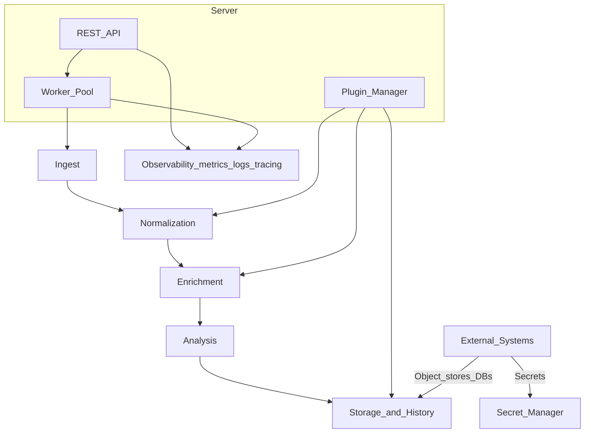

# Components Diagram

High-level component relationships shown in mermaid. Labels are compact to ensure valid rendering.

```mermaid
flowchart TD
  subgraph Server
    API[REST_API]
    WorkerPool[Worker_Pool]
    PluginMgr[Plugin_Manager]
  end

  API --> WorkerPool
  WorkerPool --> Ingest[Ingest]
  Ingest --> Normalize[Normalization]
  Normalize --> Enrich[Enrichment]
  Enrich --> Analyze[Analysis]
  Analyze --> Store[Storage_and_History]
  PluginMgr --> Normalize
  PluginMgr --> Enrich
  PluginMgr --> Store

  Observability[Observability_metrics_logs_tracing]
  API --> Observability
  WorkerPool --> Observability

  External[External_Systems]
  External -->|Object_stores_DBs| Store
  External -->|Secrets| Secrets[Secret_Manager]

  

```
