# Components Diagram

High-level component relationships showing the runtime architecture.

```mermaid
flowchart TD
  subgraph ServerRuntime["Server Runtime"]
    API["🌐 REST API<br/>(axum 0.8 + hyper)"]
    JobQueue["⏳ Job Queue<br/>(In-Memory)"]
    WorkerPool["👷 Worker Pool<br/>(Tokio Tasks)"]
  end

  subgraph PipelineStages["Processing Pipeline"]
    Ingest["Ingest"]
    Safe["Safe Ingest"]
    Norm["Normalization"]
    Dedup["Deduplication"]
    Enrich["Enrichment"]
    Analyze["Analysis"]
    Store["Storage"]
  end

  subgraph Adapters["Extensibility Points"]
    FormatAdapters["Format Adapters<br/>(CSV/TSV/JSON/YAML)"] 
    StorageAdapters["Storage Adapters<br/>(PostgreSQL/Filesystem)"]
    Enrichers["Enrichment Plugins<br/>(Ollama/HIBP)"]
  end

  API --> JobQueue
  JobQueue --> WorkerPool
  WorkerPool --> Ingest
  Ingest --> Safe
  Safe --> Norm
  Norm --> Dedup
  Dedup --> Enrich
  Enrich --> Analyze
  Analyze --> Store

  FormatAdapters --> Ingest
  Enrichers --> Enrich
  StorageAdapters --> Store

  subgraph Observability["Observability & Security"]
    Metrics["📊 Metrics"]
    Logs["📝 Structured Logs"]
    OAuth["🔐 OAuth 2.0"]
    TLS["🔒 TLS 1.3+"]
  end

  API --> OAuth
  API --> TLS
  API --> Metrics
  WorkerPool --> Logs
  Store --> Logs

  subgraph External["External Systems"]
    PostgreSQL["🗄️ PostgreSQL<br/>(pgvector, IVFFlat)"]
    Ollama["🤖 Ollama<br/>(768-dim Nomic)"]
    HIBP["🌐 Have I Been Pwned<br/>(Breach Data)"]
  end

  Store --> PostgreSQL
  Enrich --> Ollama
  Enrich --> HIBP
```

## Component Details

### Server Runtime
- **REST API**: Axum 0.8 with HTTP/2, TLS 1.3+, OAuth 2.0
- **Job Queue**: Queue for async background processing
- **Worker Pool**: Configurable number of concurrent workers (default: CPU cores)

### Pipeline Stages
- Each stage is a composable module in `src/`
- Operates independently for testability
- Supports both sync and async variants

### Extensibility Points
- **Format Adapters**: Add custom input formats via trait implementation
- **Storage Adapters**: Support multiple backends (PostgreSQL, S3, filesystem)
- **Enrichment Plugins**: WASM-based enrichers for custom analysis

### External Dependencies
- **PostgreSQL**: Primary data store with pgvector extension for embeddings
- **Ollama**: Local LLM for embedding generation (768-dim Nomic vectors)
- **Have I Been Pwned**: Breach data enrichment via HTTP API
