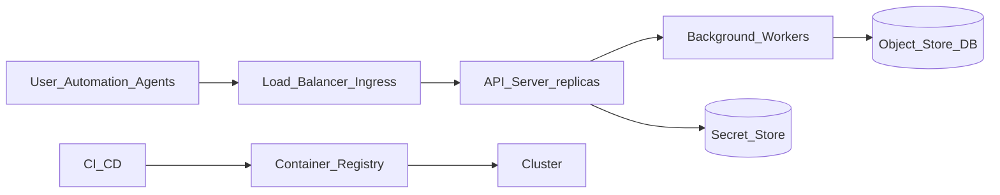

# Deployment Diagram

Deployment sketch (mermaid): ingress, API server replicas, workers, storage, and secrets. Labels simplified for consistent rendering.

Operational notes

- TLS at the ingress, OIDC/OAuth2 configured for API access, storage credentials via secret store.
