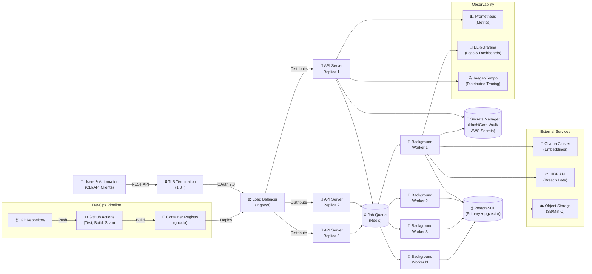

# Deployment Diagram

Production deployment architecture: ingress, API server replicas, background workers, persistent storage, and secrets management.

## Deployment Architecture

### Horizontal Scalability
- **API Servers**: Stateless replicas behind load balancer
- **Background Workers**: Configurable pool consuming from shared job queue
- **Job Queue**: Central coordination point (Redis or in-memory for small deployments)

### Security
- **TLS at Ingress**: 1.3+ with modern ciphers
- **OAuth 2.0**: Client credentials flow for API authentication
- **Secrets Management**: Vault, AWS Secrets Manager, or Kubernetes Secrets
- **Network Segmentation**: Workers isolated from public ingress

### Data Persistence
- **PostgreSQL**: Primary relational store with pgvector for embeddings
- **Object Storage**: Optional S3/MinIO for historical backups
- **Audit Logging**: PostgreSQL audit trails with pgAudit

### External Dependencies
- **Ollama Cluster**: Optional local LLM inference (can be removed for smaller deployments)
- **Have I Been Pwned API**: Requires API key (optional, degrades gracefully)
- **Cloud Storage**: Optional for multi-region redundancy

### CI/CD Pipeline
- GitHub Actions runs on every push
- Multi-platform binary builds (Linux x86_64/ARM64, macOS, Windows)
- Container images published to ghcr.io with semantic versioning
- Automated .deb packages for Debian/Ubuntu distribution

### Observability
- **Metrics**: Prometheus-compatible endpoint (`/metrics`)
- **Logs**: Structured JSON logging to stdout (container-friendly)
- **Tracing**: OpenTelemetry-compatible span export (optional)
- **Dashboards**: Grafana/Kibana for visualization

## Deployment Options

### Option 1: Docker Compose (Development)
- PostgreSQL + Ollama + Dumptruck server
- Single-machine, all services in containers
- See `docker/` directory

### Option 2: Kubernetes (Production)
- API server replicas managed by Deployment
- StatefulSet for PostgreSQL (with persistent volumes)
- ConfigMaps for configuration, Secrets for credentials
- See `docs/architecture/DEPLOYMENT.md` for k8s manifests

### Option 3: Binary Distribution
- Download .deb package for Debian/Ubuntu
- Or download pre-built binary for your platform
- Configure with environment variables or config.json
