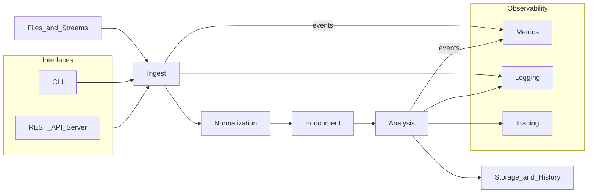

# Pipeline Diagram

The following mermaid diagram shows the primary data pipeline stages. Labels use single-line identifiers so the diagram validates and renders reliably.

Notes

- Stages are stream-oriented; where possible, components should operate record-by-record to limit memory use.
