# Pipeline Diagram

The following mermaid diagram shows the primary data pipeline stages.

```mermaid
flowchart LR
  Sources["📁 Files & Streams"] --> Analyze["Analyze<br/>(Format Detection)"]
  Analyze --> Safe["Safe Read<br/>(Validation)"]
  Safe --> Normalization["Normalization<br/>(Canonicalization)"]
  Normalization --> Dedup["Deduplication<br/>(Hash + Similarity Hints)"]
  Dedup --> Enrichment["Enrichment<br/>(Embeddings, HIBP)"]
  Enrichment --> Detection["Detection<br/>(PII/NPI)"]
  Detection --> Storage["🗄️ Storage<br/>(SQLite)"]

  subgraph Interfaces
    CLI["⌨️ CLI"] 
    API["🌐 REST API"]
  end

  CLI --> Analyze
  API --> Analyze

  subgraph Observability
    Metrics["📊 Metrics"]
    Logs["📝 Logs"]
    Tracing["🔍 Tracing"]
  end

  Analyze -->|events| Metrics
  Detection -->|events| Metrics
  Analyze --> Logs
  Detection --> Logs
  Enrichment --> Tracing
```

## Pipeline Stages

1. **Analyze**: Format detection and streaming read
2. **Safe Read**: Binary detection, UTF-8 validation, size limits
3. **Normalization**: Unicode NFKC + case-folding + punctuation normalization
4. **Deduplication**: Hash-based exact match + optional similarity hints
5. **Enrichment**: Ollama embeddings + HIBP breach data lookup
6. **Detection**: PII/NPI detection (phones, SSNs, credit cards, crypto addresses, etc.)
7. **Storage**: SQLite database with deduplication state and derived metadata

## Key Design Principles

- **Stream-oriented**: Operate record-by-record to limit memory use (constant memory for GB/TB files)
- **Privacy-preserving**: Historical data stored as non-reversible hashes
- **Error-resilient**: Malformed rows logged but processing continues (zero-crash guarantee)
- **Observable**: All stages emit metrics and structured logs
