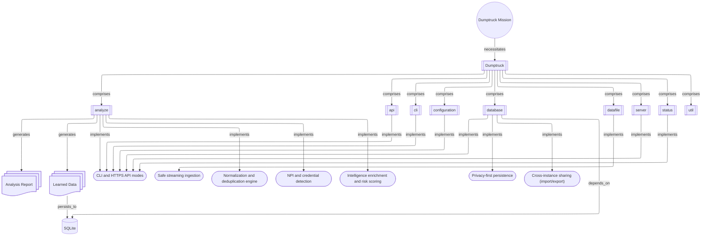

# Component View

This view shows the application’s major runtime components, artifacts, and persistence.

```mermaid
---
config:
  layout: elk
---
graph
	mission((Dumptruck Mission))
	dumptruck_application[[Dumptruck]]

	analyze[[analyze]]
	api[[api]]
	cli[[cli]]
	configuration[[configuration]]
	database[[database]]
	datafile[[datafile]]
	server[[server]]
	status[[status]]
	util[[util]]

	analysis_report[Analysis Report]@{shape: docs}
	learned_data[Learned Data]@{shape: docs}
	sqlite[(SQLite)]

	cli_and_https_api_modes([CLI and HTTPS API modes])
	safe_streaming_ingestion([Safe streaming ingestion])
	normalization_and_deduplication_engine([Normalization and deduplication engine])
	npi_and_credential_detection([NPI and credential detection])
	intelligence_enrichment_and_risk_scoring([Intelligence enrichment and risk scoring])
	privacy_first_persistence([Privacy-first persistence])
	cross_instance_sharing_import_export(["Cross-instance sharing (import/export)"])

	mission -- necessitates --> dumptruck_application
	dumptruck_application -- comprises --> database
	dumptruck_application -- comprises --> datafile
	dumptruck_application -- comprises --> analyze
	dumptruck_application -- comprises --> server
	dumptruck_application -- comprises --> util
	dumptruck_application -- comprises --> api
	dumptruck_application -- comprises --> configuration
	dumptruck_application -- comprises --> status
	dumptruck_application -- comprises --> cli

	analyze -- implements --> cli_and_https_api_modes
	analyze -- implements --> normalization_and_deduplication_engine
	analyze -- implements --> intelligence_enrichment_and_risk_scoring
	analyze -- implements --> npi_and_credential_detection
	analyze -- generates --> analysis_report
	analyze -- generates --> learned_data

	api -- implements --> cli_and_https_api_modes
	cli -- implements --> cli_and_https_api_modes
	configuration -- implements --> cli_and_https_api_modes
	server -- implements --> cli_and_https_api_modes
	status -- implements --> cli_and_https_api_modes

	datafile -- implements --> safe_streaming_ingestion

	database -- implements --> cli_and_https_api_modes
	database -- implements --> privacy_first_persistence
	database -- implements --> cross_instance_sharing_import_export
	database -- depends_on --> sqlite

	learned_data -- persists_to --> sqlite
```
