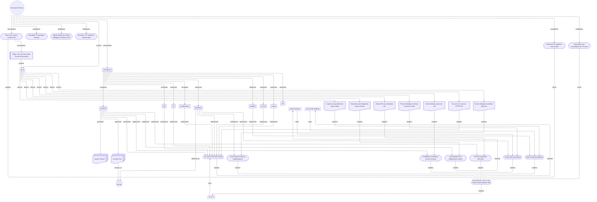

# Everything View

This view includes all Aurora cards and their relationships.

```mermaid
---
config:
  layout: elk
---
graph
	mission((Dumptruck Mission))
	user{{User}}
	dumptruck_application[[Dumptruck]]

	analyze[[analyze]]
	api[[api]]
	cli[[cli]]
	configuration[[configuration]]
	database[[database]]
	datafile[[datafile]]
	server[[server]]
	status[[status]]
	util[[util]]

	analysis_report[Analysis Report]@{shape: docs}
	learned_data[Learned Data]@{shape: docs}
	sqlite[(SQLite)]

	run_tool_in_secure_environment([Run tool in secure environment])
	setup_use_and_tear_down_secure_environment["Setup, Use, and Tear Down Secure Environment"]@{shape: lin-rect}

	strengthen_cti_program_maturity([Strengthen CTI program maturity])
	enhance_ioc_ingestion_and_curation([Enhance IOC ingestion and curation])
	operationalize_tip(["Operationalize the Threat Intelligence Platform (TIP)"])
	rationalize_and_consolidate_cti_stack([Rationalize and consolidate the CTI stack])
	develop_cti_workforce_maturity_plan([Develop a CTI workforce maturity plan])

	breach_data_analysis_tool([Breach Data Analysis Tool])

	cli_and_https_api_modes([CLI and HTTPS API modes])
	cross_instance_sharing_import_export(["Cross-instance sharing (import/export)"])
	intelligence_enrichment_and_risk_scoring([Intelligence enrichment and risk scoring])
	normalization_and_deduplication_engine([Normalization and deduplication engine])
	npi_and_credential_detection([NPI and credential detection])
	privacy_first_persistence([Privacy-first persistence])
	safe_streaming_ingestion([Safe streaming ingestion])

	data_protection[Data Protection]@{shape: card}
	secure_file_deletion[Secure File Deletion]@{shape: card}
	tls_1_3[TLS 1.3]@{shape: card}

	analyze_large_delimited_dump[Analyze a large delimited dump safely]@{shape: document}
	normalize_and_deduplicate_messy_records[Normalize and deduplicate messy records]@{shape: document}
	detect_npi_and_credential_risk[Detect NPI and credential risk]@{shape: document}
	persist_intelligence_privacy_first[Persist intelligence without storing raw data]@{shape: document}
	enrich_findings_and_score_risk[Enrich findings and score risk]@{shape: document}
	run_as_cli_or_secure_https_api[Run as CLI or secure HTTPS API]@{shape: document}
	share_intelligence_between_instances[Share intelligence between instances]@{shape: document}

	mission -- involves --> user
	mission -- necessitates --> run_tool_in_secure_environment
	mission -- establishes --> strengthen_cti_program_maturity
	mission -- establishes --> enhance_ioc_ingestion_and_curation
	mission -- establishes --> operationalize_tip
	mission -- establishes --> rationalize_and_consolidate_cti_stack
	mission -- establishes --> develop_cti_workforce_maturity_plan
	mission -- necessitates --> dumptruck_application

	user -- desires --> analyze_large_delimited_dump
	user -- desires --> normalize_and_deduplicate_messy_records
	user -- desires --> detect_npi_and_credential_risk
	user -- desires --> persist_intelligence_privacy_first
	user -- desires --> enrich_findings_and_score_risk
	user -- desires --> run_as_cli_or_secure_https_api
	user -- desires --> share_intelligence_between_instances

	dumptruck_application -- comprises --> database
	dumptruck_application -- comprises --> datafile
	dumptruck_application -- comprises --> analyze
	dumptruck_application -- comprises --> server
	dumptruck_application -- comprises --> util
	dumptruck_application -- comprises --> api
	dumptruck_application -- comprises --> configuration
	dumptruck_application -- comprises --> status
	dumptruck_application -- comprises --> cli

	run_tool_in_secure_environment -- satisfies --> breach_data_analysis_tool
	run_tool_in_secure_environment -- necessitates --> setup_use_and_tear_down_secure_environment

	setup_use_and_tear_down_secure_environment -- involves --> user

	enhance_ioc_ingestion_and_curation -- drives --> breach_data_analysis_tool
	rationalize_and_consolidate_cti_stack -- drives --> breach_data_analysis_tool

	breach_data_analysis_tool -- imposes --> secure_file_deletion
	breach_data_analysis_tool -- imposes --> tls_1_3
	breach_data_analysis_tool -- imposes --> data_protection

	cli_and_https_api_modes -- satisfies --> breach_data_analysis_tool
	cross_instance_sharing_import_export -- satisfies --> breach_data_analysis_tool
	intelligence_enrichment_and_risk_scoring -- satisfies --> breach_data_analysis_tool
	normalization_and_deduplication_engine -- satisfies --> breach_data_analysis_tool
	npi_and_credential_detection -- satisfies --> breach_data_analysis_tool
	privacy_first_persistence -- satisfies --> breach_data_analysis_tool
	safe_streaming_ingestion -- satisfies --> breach_data_analysis_tool

	data_protection -- limits --> privacy_first_persistence
	secure_file_deletion -- limits --> safe_streaming_ingestion
	tls_1_3 -- limits --> cli_and_https_api_modes

	analyze -- implements --> cli_and_https_api_modes
	analyze -- implements --> normalization_and_deduplication_engine
	analyze -- implements --> intelligence_enrichment_and_risk_scoring
	analyze -- implements --> npi_and_credential_detection
	analyze -- generates --> analysis_report
	analyze -- generates --> learned_data

	api -- implements --> cli_and_https_api_modes
	cli -- implements --> cli_and_https_api_modes
	configuration -- implements --> cli_and_https_api_modes
	database -- implements --> cli_and_https_api_modes
	database -- implements --> privacy_first_persistence
	database -- implements --> cross_instance_sharing_import_export
	database -- depends_on --> sqlite
	datafile -- implements --> safe_streaming_ingestion
	server -- implements --> cli_and_https_api_modes
	status -- implements --> cli_and_https_api_modes

	learned_data -- persists_to --> sqlite

	analyze_large_delimited_dump -- explains --> safe_streaming_ingestion
	detect_npi_and_credential_risk -- explains --> npi_and_credential_detection
	enrich_findings_and_score_risk -- explains --> intelligence_enrichment_and_risk_scoring
	normalize_and_deduplicate_messy_records -- explains --> normalization_and_deduplication_engine
	persist_intelligence_privacy_first -- explains --> privacy_first_persistence
	run_as_cli_or_secure_https_api -- explains --> cli_and_https_api_modes
	share_intelligence_between_instances -- explains --> cross_instance_sharing_import_export
```
