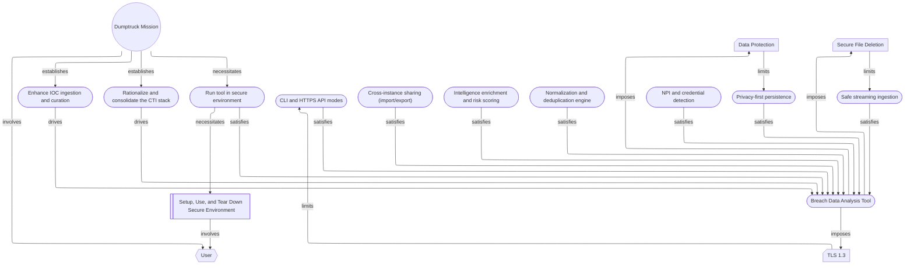

# Requirements View

This view connects mission and drivers to requirements, features, capabilities, and constraints.

```mermaid
---
config:
  layout: elk
---
graph
	mission((Dumptruck Mission))
	user{{User}}
	enhance_ioc_ingestion_and_curation([Enhance IOC ingestion and curation])
	rationalize_and_consolidate_cti_stack([Rationalize and consolidate the CTI stack])
	run_tool_in_secure_environment([Run tool in secure environment])
	setup_use_and_tear_down_secure_environment["Setup, Use, and Tear Down Secure Environment"]@{shape: lin-rect}
	breach_data_analysis_tool([Breach Data Analysis Tool])

	cli_and_https_api_modes([CLI and HTTPS API modes])
	cross_instance_sharing_import_export(["Cross-instance sharing (import/export)"])
	intelligence_enrichment_and_risk_scoring([Intelligence enrichment and risk scoring])
	normalization_and_deduplication_engine([Normalization and deduplication engine])
	npi_and_credential_detection([NPI and credential detection])
	privacy_first_persistence([Privacy-first persistence])
	safe_streaming_ingestion([Safe streaming ingestion])

	data_protection[Data Protection]@{shape: card}
	secure_file_deletion[Secure File Deletion]@{shape: card}
	tls_1_3[TLS 1.3]@{shape: card}

	mission -- involves --> user
	mission -- necessitates --> run_tool_in_secure_environment
	mission -- establishes --> enhance_ioc_ingestion_and_curation
	mission -- establishes --> rationalize_and_consolidate_cti_stack

	enhance_ioc_ingestion_and_curation -- drives --> breach_data_analysis_tool
	rationalize_and_consolidate_cti_stack -- drives --> breach_data_analysis_tool

	run_tool_in_secure_environment -- satisfies --> breach_data_analysis_tool
	run_tool_in_secure_environment -- necessitates --> setup_use_and_tear_down_secure_environment
	setup_use_and_tear_down_secure_environment -- involves --> user

	cli_and_https_api_modes -- satisfies --> breach_data_analysis_tool
	cross_instance_sharing_import_export -- satisfies --> breach_data_analysis_tool
	intelligence_enrichment_and_risk_scoring -- satisfies --> breach_data_analysis_tool
	normalization_and_deduplication_engine -- satisfies --> breach_data_analysis_tool
	npi_and_credential_detection -- satisfies --> breach_data_analysis_tool
	privacy_first_persistence -- satisfies --> breach_data_analysis_tool
	safe_streaming_ingestion -- satisfies --> breach_data_analysis_tool

	breach_data_analysis_tool -- imposes --> secure_file_deletion
	breach_data_analysis_tool -- imposes --> tls_1_3
	breach_data_analysis_tool -- imposes --> data_protection

	data_protection -- limits --> privacy_first_persistence
	secure_file_deletion -- limits --> safe_streaming_ingestion
	tls_1_3 -- limits --> cli_and_https_api_modes
```
