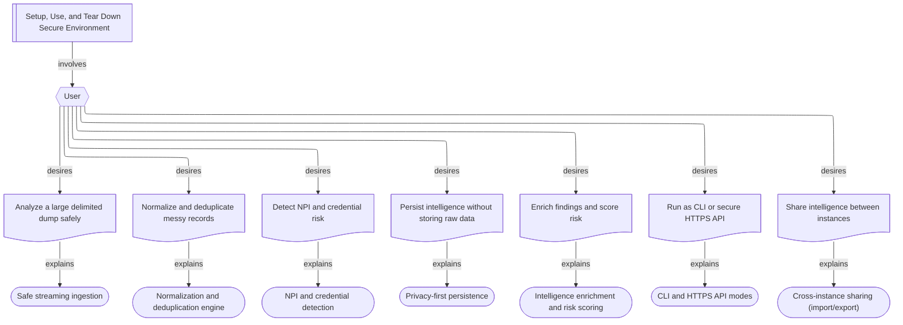

# Story View

This view connects the user to stories and the features they explain.

```mermaid
---
config:
  layout: elk
---
graph
	user{{User}}
	setup_use_and_tear_down_secure_environment["Setup, Use, and Tear Down Secure Environment"]@{shape: lin-rect}

	analyze_large_delimited_dump[Analyze a large delimited dump safely]@{shape: document}
	normalize_and_deduplicate_messy_records[Normalize and deduplicate messy records]@{shape: document}
	detect_npi_and_credential_risk[Detect NPI and credential risk]@{shape: document}
	persist_intelligence_privacy_first[Persist intelligence without storing raw data]@{shape: document}
	enrich_findings_and_score_risk[Enrich findings and score risk]@{shape: document}
	run_as_cli_or_secure_https_api[Run as CLI or secure HTTPS API]@{shape: document}
	share_intelligence_between_instances[Share intelligence between instances]@{shape: document}

	safe_streaming_ingestion([Safe streaming ingestion])
	normalization_and_deduplication_engine([Normalization and deduplication engine])
	npi_and_credential_detection([NPI and credential detection])
	privacy_first_persistence([Privacy-first persistence])
	intelligence_enrichment_and_risk_scoring([Intelligence enrichment and risk scoring])
	cli_and_https_api_modes([CLI and HTTPS API modes])
	cross_instance_sharing_import_export(["Cross-instance sharing (import/export)"])

	setup_use_and_tear_down_secure_environment -- involves --> user

	user -- desires --> analyze_large_delimited_dump
	user -- desires --> normalize_and_deduplicate_messy_records
	user -- desires --> detect_npi_and_credential_risk
	user -- desires --> persist_intelligence_privacy_first
	user -- desires --> enrich_findings_and_score_risk
	user -- desires --> run_as_cli_or_secure_https_api
	user -- desires --> share_intelligence_between_instances

	analyze_large_delimited_dump -- explains --> safe_streaming_ingestion
	normalize_and_deduplicate_messy_records -- explains --> normalization_and_deduplication_engine
	detect_npi_and_credential_risk -- explains --> npi_and_credential_detection
	persist_intelligence_privacy_first -- explains --> privacy_first_persistence
	enrich_findings_and_score_risk -- explains --> intelligence_enrichment_and_risk_scoring
	run_as_cli_or_secure_https_api -- explains --> cli_and_https_api_modes
	share_intelligence_between_instances -- explains --> cross_instance_sharing_import_export
```
